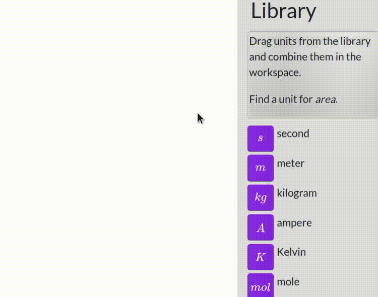

# Metric Meld

Metric Meld is an open-source web game that lets you combine SI units to create more complex units. It's a fun and educational way to learn about the Metric System while engaging in an exciting puzzle-solving experience.

## Running

Install dependencies with `npm i`.

Start the webpack dev server with `npm start`.
